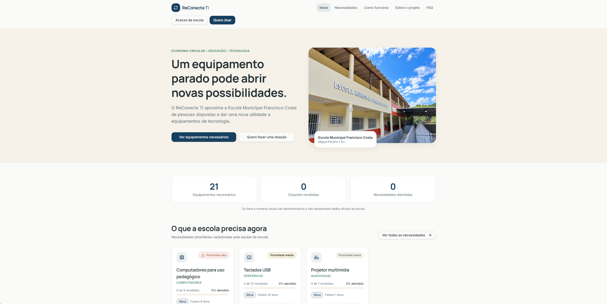

# ReConecta TI

Plataforma acadêmica de economia circular para registrar necessidades de equipamentos de tecnologia e intenções de doação à Escola Municipal Francisco Costa, em Miguel Pereira (RJ). A interface existente foi conectada a uma API Node.js.

## Página inicial



## Contexto e motivação

Equipamentos de informática ainda úteis podem ficar sem uso enquanto escolas e comunidades precisam de recursos tecnológicos para apoiar atividades pedagógicas. O ReConecta TI foi idealizado para aproximar esses dois lados: a escola pode apresentar necessidades de equipamentos, e pessoas ou organizações podem registrar intenções de doação e acompanhar o encaminhamento.

A proposta também incentiva o reaproveitamento responsável de equipamentos, prolongando sua vida útil e contribuindo para a economia circular. A plataforma é um meio de facilitar a comunicação e organizar informações; ela não substitui a avaliação da escola nem garante que uma doação será aceita ou realizada.

## Projeto acadêmico e extensionista

O ReConecta TI foi desenvolvido para a disciplina de **Atividades Extensionistas** do curso de **Análise e Desenvolvimento de Sistemas** da **UNINTER**. O projeto aplica conhecimentos de desenvolvimento de software em uma iniciativa com finalidade educacional e social, voltada a facilitar a conexão entre a comunidade e a Escola Municipal Francisco Costa, em Miguel Pereira (RJ).

**Dados de demonstração:** as necessidades e intenções adicionadas pelo seed são exemplos para apresentar o sistema. Não representam inventário ou informações oficiais da escola.

## Tecnologias

- Frontend: React, TypeScript, TanStack Start/Router, Vite, Tailwind CSS, shadcn/ui e TanStack Query.
- Backend: Node.js, TypeScript, Express 5, Prisma ORM e SQLite.
- Formulários: React Hook Form e Zod.

## Requisitos

- Node.js 20.19+ (desenvolvido/verificado com Node 24)
- Bun (o repositório já usa `bun.lock`)
- Docker para empacotamento e deploy em plataformas como Coolify

## Instalação e ambiente

```sh
bun install
bun install --cwd backend
Copy-Item backend/.env.example backend/.env
```

Edite `backend/.env` antes de iniciar. Defina uma senha local para `ADMIN_PASSWORD` (mínimo de 8 caracteres) e um segredo aleatório para `JWT_SECRET`. O usuário seed usa o `ADMIN_EMAIL` configurado, por padrão `admin@reconectati.local`. A senha não é incluída no código. O arquivo `.env` é ignorado pelo Git.

O frontend lê `VITE_API_URL`; o padrão local é `http://localhost:3001/api`. Para alterar, crie um `.env` na raiz com:

```env
VITE_API_URL=http://localhost:3002/api
```

`CORS_ORIGIN` lista origens permitidas separadas por vírgula. A API usa a porta 3002 por padrão (configurável em `PORT`) para evitar conflito comum com serviços locais na 3001. `DATABASE_URL` vem como `file:./dev.db` e cria o SQLite local em `backend/prisma/dev.db`.

## Banco e seed

```sh
bun run --cwd backend prisma:generate
bun run --cwd backend prisma:migrate -- --name init
bun run --cwd backend prisma:seed
```

O seed cria o administrador e necessidades/intenção de doação demonstrativas, identificadas no banco pela flag `demoData`. Para trocar SQLite por PostgreSQL no futuro, altere o provider e `DATABASE_URL`, gere novas migrations e mantenha services/regras do domínio.

## Executar

```sh
bun run dev
```

O comando inicia Vite e API ao mesmo tempo. Também é possível iniciar cada processo:

```sh
bun run dev:frontend
bun run dev:backend
```

## Docker Compose local

É necessário ter Docker Engine e Docker Compose instalados. Copie a configuração de exemplo para o `.env` da raiz do projeto, defina `ADMIN_PASSWORD` com pelo menos 8 caracteres e gere um segredo JWT:

```powershell
Copy-Item .env.docker.example .env
```

```powershell
[Convert]::ToBase64String([Security.Cryptography.RandomNumberGenerator]::GetBytes(48))
```

Coloque o segredo gerado em `JWT_SECRET` no `.env` e defina uma senha forte, com pelo menos 8 caracteres, em `ADMIN_PASSWORD`. Depois, na raiz do projeto:

```sh
docker compose --profile local up --build -d
```

Acesse <http://localhost:8080>. O serviço `gateway-local` do perfil `local` publica a porta no computador; o serviço `gateway` permanece sem publicação de porta, como esperado no Coolify. O proxy encaminha `/api` para a API e as demais rotas para o frontend. O volume Docker `reconecta-data` mantém o SQLite entre reinicializações. Para parar os contêineres, use `docker compose --profile local down`; evite `docker compose down -v` se quiser preservar o banco.

No modo local, a porta e o endereço de bind são configuráveis por `APP_PORT` e `APP_BIND_IP`; `APP_ORIGIN` deve corresponder ao endereço acessado pelo navegador. `VITE_API_URL` deve permanecer `/api` quando o proxy incluso estiver em uso.

## Deploy no Coolify

Crie uma aplicação a partir do repositório GitHub usando o modo **Docker Compose**, a raiz do repositório como diretório e `docker-compose.yml` como arquivo Compose. Não ative o perfil `local` no Coolify.

Configure no painel do Coolify:

- `APP_ORIGIN` com a origem HTTPS pública, sem barra final, por exemplo `https://reconecta.exemplo.com`.
- `JWT_SECRET` com um segredo aleatório de pelo menos 32 caracteres.
- `ADMIN_EMAIL` como `admin@reconectati.local`, que é a conta padrão de administrador.
- `ADMIN_PASSWORD` como segredo do Coolify, com pelo menos 8 caracteres. Não coloque a senha no repositório.
- Opcionalmente, `ADMIN_NAME` e `JWT_EXPIRES_IN`.

O seed cria ou atualiza essa conta em cada inicialização da API com o `ADMIN_EMAIL` e `ADMIN_PASSWORD` configurados. Para usar a senha desejada, cadastre-a no campo `ADMIN_PASSWORD` das variáveis do Coolify. Mantenha `VITE_API_URL` como `/api` (valor padrão). Associe o domínio ao serviço `gateway`, na porta interna `80`. O Coolify termina o HTTPS e encaminha o tráfego ao Caddy; o Caddy distribui `/api` para a API e as demais rotas para o frontend. A porta não é publicada no host no modo Coolify. O SQLite permanece no volume `reconecta-data`; mantenha esse armazenamento persistente ao recriar a aplicação. As imagens do frontend e da API são construídas pelo próprio Compose.

Build, lint e verificação de tipos:

```sh
bun run build
bun run build:backend
bun run lint
bun run typecheck
bun run test
```

## Fluxos e rotas principais

- Público: `/`, `/necessidades`, `/necessidades/:id`, `/doar`, `/doacao/enviada`, `/acompanhar`.
- Institucional: `/como-funciona`, `/sobre`, `/faq`, `/privacidade`, `/termos`.
- Administração: `/admin/login`, `/admin`, `/admin/necessidades`, `/admin/doacoes`, `/admin/relatorios` e `/admin/configuracoes`.
- API: `/api/health`, `/api/auth`, `/api/needs`, `/api/donations`, `/api/admin/dashboard` e `/api/admin/reports`.

## Estrutura

```text
src/                    Frontend React/TanStack
  routes/               Páginas TanStack por arquivo
  components/           Layouts, formulários e UI
  services/             Adaptadores HTTP usados pelas páginas
  config/api.ts         URL centralizada e cliente HTTP
  types/                Tipos compartilhados com a API
backend/
  prisma/               Schema, migrations e seed
  src/config/           Ambiente e Prisma Client
  src/controllers/       Respostas HTTP
  src/routes/            Endpoints Express
  src/services/          Regras de domínio
  src/repositories/      Acesso Prisma
  src/middlewares/       Autenticação e erros
  src/schemas/           Validação Zod
docs/                   Arquitetura e plano de backend
```
